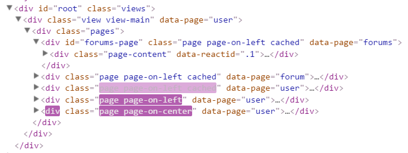

title: Redux 几个应用的讨论
date: 2015-07-31 17:29:44
tags:
- Redux
id: a-redux-problem
---

= Redux 几个应用的讨论

== 背景

=== 『头疼』的问题

最近一个项目用到了『Redux』框架，碰到几个棘手的问题，在解决问题的过程中有些心得和讨论，与大家分享一下。

这个项目是一个重构项目，老代码是基于 Framework7 及 React 的实现的 React 做组件渲染，Framework7 提供一些移动的 UI 和交互（譬如：左滑，翻页，动画等）。逻辑层采用了类 MVC 架构，自己实现了 Controllers，但是无论从代码结构还是业务逻辑都算是个练手的东东，连半成品都算不上。

重构后的项目将作为钉钉微应用接入，因此有些交互还要依赖钉钉的 JSAPI。这个项目工期比较紧，只有大约 4 周时间，大约 1.5 个前端人力，使用 React 组件完全替换 Framework7 的交互、动画不现实，所以项目还是保留 Framework7，又引入钉钉的 JSAPI，React组件做到独立且 UI 无依赖。

=== 介绍下这个开源项目

==== Framework7

Framework7 是一个开源免费的框架可以用来开发混合移动应用（原生和 HTML 混合）或者开发 iOS & Android 风格的 WEB APP。也可以用来作为原型开发工具，可以迅速创建一个应用的原型。Framework7 最主要的功能是可以使用 HTML、CSS 和 JS 来开发 iOS7 应用。Framework7 是完全免费开源的。footnote:[Framework7 中文站：link:http://framework7.taobao.org/[]]

image::http://framework7.taobao.org/i/logo-new.png[Framework7, title="Framework7",width=200]

==== React

React is a JavaScript library for creating user interfaces by Facebook and Instagram. Many people choose to think of React as the V in MVC.

We built React to solve one problem: building large applications with data that changes over time. footnote:[Why react from react docs: link:http://facebook.github.io/react/docs/why-react.html[]]

image::http://image.beekka.com/blog/2015/bg2015033101.png[React图标, title="React",width=400]

==== Redux

Redux is a predictable state container for JavaScript apps.

It helps you write applications that behave consistently, run in different environments (client, server, and native), and are easy to test. On top of that, it provides a great developer experience, such as live code editing combined with a time traveling debugger. footnote:[http://rackt.org/redux/]

== 问题

=== 问题一：Framework7 与 React 如何融合？

==== 描述

『Framework7的应用』会有一套专门的 HTML 组织形式，有专门的事件机制，有大量的『生成』样式等，还有各种动画效果，这些元素是无法通过 React 组件渲染出来的。它的组件中还含有大量的内部状态，这些状态也无法被 React/Redux 接管。

而且 Framework7 在页面中只能做『主角』，页面必须满足它的标签组织要求，譬如：根节点是 `

` 等。

==== 方案

既然 Framework7 那么『强势』，只能由它搭起页面的『架子』来。这儿的『架子』指：View、Page、Popup等无逻辑、有 UI 和动画的容器。而剩下的部分，全部由 React 组件来渲染，譬如 Page
的内容等。

.代码示例
[source, html]
----

  

    

      

        <!-- 此处内容由 React 接管 -->
      

    

  

----

另外，利用了 Framework7 提供的事件机制，还可以自动将 React 组件渲染到 Framework7 的 Page 里。

.自动将 React 组件渲染到 Framework7 的 Page 里
[source, javascript]
----
const pageContainers = {
  forums: Forums,
  forum: Forum,
  post: Post,
  user: User
};

$$(document).on('pageBeforeInit', (e) => {
  const page = e.detail.page;
  const Container = pageContainers[page.name];
  if (!Container) {
    return;
  }
  render(
    <Provider store={store}>
      <Container query={page.query} />
    </Provider>,
    page.container
  );
});

$$(document).on('pageBeforeRemove', (e) => {
  const page = e.detail.page;
  unmountComponentAtNode(page.container);
});
----

至此，Framework7 和 React 的工作职责已经明确的划分好了。

=== 问题二：被拆分到各个 Page 的 React 组件如何与 Redux 通信

==== 描述

.一段 Redux/React 的入口代码 footnote:[http://rackt.org/redux/docs/basics/UsageWithReact.html]
[source, javascript]
----
let store = createStore(todoApp)

let rootElement = document.getElementById('root')
render(
  <Provider store={store}>
    <App>
      <Tab>
        <Page1 />
        <Page2 />
        <Page3 />
        <Page4 />
      </Tab>
    </App>
  </Provider>,
  rootElement
)
----

如上代码所示，一般的 Redux/React 项目里，都是由一个『容器 Container』（本例中为 App），将 store 和其容纳的大量的『组件 Component』（如：Tab、Page1-Page4）关联起来，所有的组件需要的状态均由这个容器从 store 里获取并传递给组件。

然而，在我们的项目里，组件被拆到各个 Page 中去了，而且由于 Framework7 的原因，无法使用一个统一的全局『容器 Container』来管理所有的组件。

==== 方案

鉴于上面所描述的局限性，在项目中，我们将采用多个『容器 Container』的方式，为每一个 Page 分配一个『容器 Container』，这个容器将管理这个 Page 下的所有组件。**这些『容器 Container』共用一个 store。**

.代码示例
[source, javascript]
----
$$(document).on('pageBeforeInit', (e) => {
  const page = e.detail.page;
  const Container = pageContainers[page.name];
  if (!Container) {
    return;
  }
  render(
    <Provider store={store}>   <= 容器共用一个 store
      <Container query={page.query} />
    </Provider>,
    page.container
  );
});
----

=== 问题三：如何调用 Framework7 提供的功能？

=== 问题四：如何存储和使用 Framework7 的 `app` 对象？

=== 问题五：如何解耦 UI ？

=== 问题六：异步操作如何加锁？

=== 问题七：React 里面用一些 Framework7 组件。

=== 问题八：『滑屏』

=== 问题九：如何设计 Store 的 State？

=== 问题十：React 组件的 `props` 如何设计？